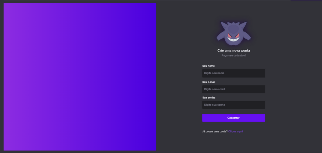
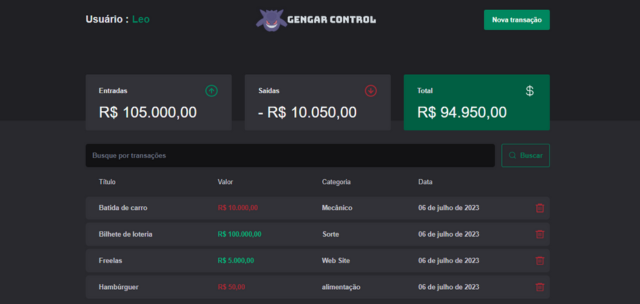
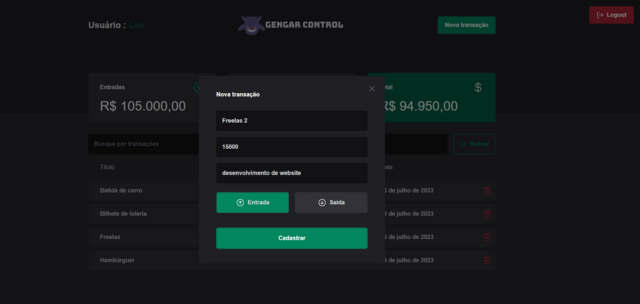

  <h1>Controle de finanças com login</h1>
  

## 🚀 Página de Login

  

## 🚀 Página de Cadastro

  

## 🚀 Página da aplicação

  

## 🚀 Modal

  

## 🚀 Preview

<iframe width="560" height="315" src="https://vimeo.com/846319830?share=copy#t=3" frameborder="0" allowfullscreen></iframe>

  <a href="#-tecnologias">Tecnologias</a>&nbsp;&nbsp;&nbsp;|&nbsp;&nbsp;&nbsp;
  <a href="#-projeto">Projeto</a>&nbsp;&nbsp;&nbsp;|&nbsp;&nbsp;&nbsp;

 

## 🚀 Tecnologias

Esse projeto foi desenvolvido com as seguintes tecnologias:

- [ReactJS](https://reactjs.org/)
- [Vite](https://vitejs.dev/)
- [Typescript](https://www.typescriptlang.org/)
- [TailwindCSS](https://tailwindcss.com/)
- [React-Hook-Form](https://react-hook-form.com/)
- [Zod](https://zod.dev/)
- [Radix](https://www.radix-ui.com/)
- [Axios](https://axios-http.com/ptbr/docs/intro)
- [React-Toastify](https://fkhadra.github.io/react-toastify/introduction)

## 💻 Projeto

Este projeto trata-se de uma segunda versão do <a href="https://github.com/Leorrc/gengar-control/tree/master">Gengar-Control-v1</a>. Tendo como principais mudanças e funcionalidades:

**Cadastro/Login do usuário**:

- [x] Página para registro de um novo usuário, passando (name, email e password);
- [x] Login do usuário (Autenticação do user feita com JWT que vem da api, lá na api ele verifica se o user é válido tanto no email/password e retorna):
  - 1 - Validação de todos os inputs do form, feita com zod e react-hook-form.
  - 2 - Caso o user não esteja autenticado, não consegue acessar a page /transactions.
- [x] É possível se deslogar da aplicação.

**Transações**:

- [x] Listagem de todas as transações correspondentes daquele usuário.
- [x] Modal para adicionar/cadastrar uma nova transação passando: title, amount, category, type
- [x] É possível excluir também uma transação (há uma validação perguntando se realmente deseja excluir aquele item!)
- [x] É exibido o cálculo das entradas, saídas e total
- [x] Campo de busca com

**Profile**:

- [x] Exibição do name do user no top da aplicação;

## 🚀 Autor

- [Leonardo Carvalho](https://www.linkedin.com/in/leocarvalhodev/)

Made with 💜 &nbsp;by Leonardo Carvalho 👋 &nbsp;[See my linkedin](https://www.linkedin.com/in/leocarvalhodev/)
